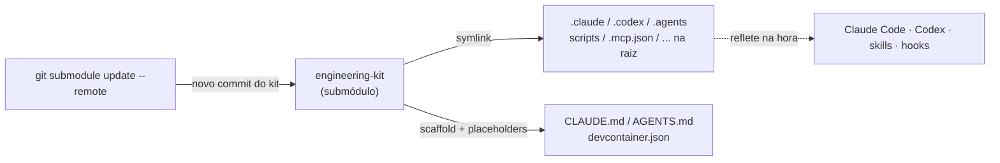

<div align="center">

# 🧰 wesleyosantos91-engineering-kit

**Meu kit de engenharia reutilizável** — skills, agents, commands, hooks, DevContainer
poliglota, quality gates, MCPs e scripts — consumido por **qualquer projeto** como um
**git submodule**, com **uma fonte única** para atualizar tudo de uma vez.

<br/>

[](LICENSE)
[](#-quickstart)
[](#o-que-vem-no-kit-kit)
[](https://github.com/wesleyosantos91)

**Toolchains do DevContainer**


**Testes de carga & IA**


</div>

> **Pare de reconfigurar o ambiente do zero a cada projeto/máquina.** Adicione o kit uma
> vez e mantenha **uma fonte única**: ao evoluir o kit, todos os repositórios que o usam
> se atualizam com **um comando** — sem recopiar nada.

Projeto **independente e autossuficiente** (não depende de nenhum outro repositório). O
escopo é **só configuração**: harness de IA + DevContainer poliglota + ferramentas —
**sem** código de aplicação.

## ✨ Destaques

- 🔗 **Consumo via git submodule** — `bootstrap.sh` popula a raiz do projeto com symlinks; atualizar é só `git submodule update --remote`.
- 🧰 **DevContainer poliglota** — Java/Maven/Gradle, Python, Go, Rust, Terraform, AWS CLI, Node, Docker-in-Docker, prontos para estudar, POCs e dev.
- 🤖 **Harness de IA** — agents, skills, commands e hooks para **Claude Code e Codex**, com MCPs registrados.
- ⚡ **Token-savers** — RTK e Caveman iniciados para Claude **e** Codex.
- ✅ **Quality gates Java 25** — Spotless, Checkstyle, JaCoCo, PIT, ArchUnit (opt-in).
- 📐 **Spec-driven** — fluxo PRD → OpenSpec → SDD → TDD.
- 🧪 **Teste de carga** — k6 e JMeter.

## 📑 Índice

- [Destaques](#-destaques)
- [DevContainer poliglota](#-devcontainer-poliglota)
- [Como funciona (a "fonte única")](#-como-funciona-a-fonte-única)
- [Quickstart](#-quickstart)
- [Atualizar o kit](#-atualizar-o-kit-puxar-a-evolução)
- [Scripts](#-scripts)
- [O que vem no kit](#o-que-vem-no-kit-kit)
- [Documentação](#-documentação-detalhada)
- [Contribuindo](#-contribuindo)
- [Licença](#-licença)

## 🧰 DevContainer poliglota

O DevContainer já sobe com as toolchains do dia a dia — pronto para estudar, fazer POCs e desenvolver:

| Toolchain | Como vem |
|---|---|
| **Java 25** (Temurin) + **Maven** + **Gradle** | feature do devcontainer |
| **Python 3.12** + `uv` | feature + `install-tools.sh` |
| **Go** | feature do devcontainer |
| **Rust** (cargo/rustup) | feature do devcontainer |
| **Terraform** | feature do devcontainer |
| **AWS CLI** | feature do devcontainer |
| **JMeter** | `install-tools.sh` (Apache JMeter) |
| **k6** | `install-tools.sh` (teste de carga; dashboard web embutido, sem Grafana) |
| Node 22, Docker-in-Docker | features do devcontainer |
| Claude Code, Codex, RTK, OpenSpec, Repomix + MCPs | `install-tools.sh` (RTK/OpenSpec já iniciados) |
| **Caveman** (+ `caveman-review`) | `install-tools.sh` (token-saver, instalado e iniciado) |

---

## 🔌 Como funciona (a "fonte única")



O segredo é **symlink**:

- Tudo que é **estável** (skills, agents, commands, hooks, scripts, devcontainer,
  quality configs) é **symlinkado** do submódulo para a raiz do seu projeto.
  → Atualizou o kit? `git submodule update --remote` e os symlinks **já apontam** para
  o novo conteúdo. **Você não recopia nada.**
- Os poucos arquivos que precisam de valor por-projeto (`CLAUDE.md`, `AGENTS.md`,
  `.ai/harness.yaml`, `.devcontainer/devcontainer.json`,
  `config/pom-quality-plugins.example.xml`) são **copiados e personalizados**
  (substituindo `__BASE_PACKAGE__` / `__PROJECT_NAME__`) — ficam editáveis por você.

Detalhes e a tabela completa do que é symlink vs cópia: [`docs/architecture.md`](docs/architecture.md).

---

## 🚀 Quickstart

```bash
# 1. adicionar o kit como submódulo
git submodule add https://github.com/wesleyosantos91/wesleyosantos91-engineering-kit .engineering-kit
git config -f .gitmodules submodule..engineering-kit.branch main   # rastrear o branch main

# 2. popular a raiz do projeto com os configs (.claude/.agents/.codex/scripts/...)
bash .engineering-kit/bootstrap.sh

# 3. versionar
git add -A && git commit -m "chore: adiciona engineering-kit"
```

O `bootstrap.sh` (dentro do submódulo) **popula a raiz** do seu projeto: `.claude/`,
`.codex/`, `.agents/`, `.ai/`, `scripts/`, `.mcp.json` viram **symlinks** na raiz
apontando pro submódulo; `CLAUDE.md`, `AGENTS.md`, `.ai/harness.yaml`,
`.devcontainer/devcontainer.json` são personalizados (**base package auto-detectado** do
seu `src/main/java`).

Agora **abra no DevContainer** (*Reopen in Container* → config
`.engineering-kit/kit/.devcontainer/devcontainer.json`). O **mesmo `bootstrap.sh`** roda
no `postCreate` e, por estar dentro do container, **instala as toolchains e CLIs**
(Java/Maven/Gradle/Python/Go/Rust/Terraform/AWS/JMeter/k6 + Claude Code, Codex, RTK,
OpenSpec, Repomix, Caveman) e **registra os MCPs**.

> Pode até pular o passo 2: se você só fizer `git submodule add` e subir o DevContainer,
> o `postCreate` roda o `bootstrap.sh` e popula a raiz **e** instala as ferramentas de uma
> vez. Rodar o passo 2 antes só serve para já ver/commitar as pastas na raiz fora do container.

### Clone com tudo de uma vez

Depois do 1º boot os symlinks (inclusive `.devcontainer/`) ficam versionados, então quem
clonar o projeto **com submódulos** sobe com tudo:

```bash
git clone --recurse-submodules https://github.com/voce/seu-projeto.git
# abra no VS Code -> "Reopen in Container"
```

> Clonou sem `--recurse-submodules`? `git submodule update --init --recursive` e reabra o
> container. No Windows sem Developer Mode, ver [`docs/windows.md`](docs/windows.md).

Passo a passo detalhado: [`docs/getting-started.md`](docs/getting-started.md).

> **Windows:** symlinks exigem **Developer Mode** ligado (ou rodar o `install.sh`
> dentro do DevContainer, que é Linux). Veja [`docs/windows.md`](docs/windows.md).

---

## 🔄 Atualizar o kit (puxar a evolução)

```bash
# dentro do projeto consumidor
bash .engineering-kit/update.sh                 # = submodule update --remote + re-checa symlinks
git add .engineering-kit && git commit -m "chore: bump engineering-kit"
```

Os configs symlinkados refletem o novo conteúdo na hora. O `install.sh` só é re-executado
para criar symlinks de **itens novos** que o kit passou a oferecer. Mais em
[`docs/updating.md`](docs/updating.md).

---

## 🧩 Scripts

| Script | O que faz |
|---|---|
| `install.sh`   | Cria os symlinks e personaliza os arquivos por-projeto no repo alvo. Flags: `--base-package`, `--name`, `--force`, `--target`. |
| `update.sh`    | `git submodule update --remote --merge` + re-checagem de symlinks novos. |
| `uninstall.sh` | Remove os symlinks e o bloco do `.gitignore`. `--purge-copies` remove também os arquivos copiados. |

---

## O que vem no kit (`kit/`)

| Caminho | Conteúdo |
|---|---|
| `.claude/`    | agents, commands, **skills** (inclui `prd-produto`), `settings.example.json` |
| `.codex/`     | agents, skills, `config.example.toml`, perfis MCP |
| `.agents/`    | skills para o Codex (espelho das skills) |
| `.ai/`        | rules, prompts, references, templates, `harness.yaml` |
| `.devcontainer/` | DevContainer poliglota (Java/Python/Go/Rust/Terraform/AWS/JMeter) + `install-tools.sh` (CLIs e MCPs) |
| `scripts/`    | `ai/`, `quality/`, **`hooks/`**, `lib/`, `mcp/` |
| `config/`     | checkstyle (Java 25), spotless, archunit, pitest, plugins de pom |
| `docs/ai-harness/` | documentação do harness (agents, skills, MCP, quality gates, OpenSpec/SDD) |
| `.mcp.json`, `openspec/config.yaml`, `compose.yaml`, `infra/localstack/` | MCPs, OpenSpec, lab LocalStack |

### O que **NÃO** vem (de propósito)
- Código de aplicação (`src/`, `pom.xml`, `mvnw`) — cada projeto traz o seu.
- Estado local/gerado: `.ai/reports/*`, `.claude/settings.local.json`, `.codex/config.toml`, `**/.terraform/`.
- Qualquer secret. Tokens/credenciais vêm sempre de variáveis de ambiente (`.env`, nunca commitado).

---

## Evoluir o kit

Edite o payload em `kit/` e rode os validadores antes de commitar:

```bash
cd kit
bash scripts/ai/validate-skills.sh
bash scripts/ai/validate-claude-agents.sh
bash scripts/ai/validate-codex-agents.sh
```

Projetos que usam o kit puxam a evolução com `bash .engineering-kit/update.sh`.

---

## 📚 Documentação detalhada

Guias passo a passo em [`docs/`](docs/):

| Documento | O que cobre |
|---|---|
| [`docs/commands.md`](docs/commands.md) | **Cheatsheet** de comandos/skills/ferramentas (prd, rtk, caveman, k6, qualidade…) p/ Claude e Codex. |
| [`docs/getting-started.md`](docs/getting-started.md) | Adicionar o submódulo, rodar o `bootstrap.sh`, abrir o DevContainer, flags, verificação. |
| [`docs/updating.md`](docs/updating.md) | Como o `git submodule update --remote` propaga skills/configs novas (e o que exige re-rodar). |
| [`docs/architecture.md`](docs/architecture.md) | Decisão symlink × cópia, detecção de placeholders, layout do repositório. |
| [`docs/windows.md`](docs/windows.md) | Symlinks no Windows (Developer Mode / `core.symlinks`) e como evitar o problema de CRLF. |

E dentro do kit, [`kit/docs/ai-harness/`](kit/docs/ai-harness/) documenta o harness de IA
(agents, skills, MCP, quality gates, OpenSpec/SDD).

---

## 🤝 Contribuindo

Kit pessoal, mas sugestões são bem-vindas:

1. Abra uma **issue** descrevendo a ideia/bug.
2. Para mudanças no payload, edite em `kit/` e rode os validadores antes do PR:
   ```bash
   cd kit && bash scripts/ai/validate-skills.sh && \
     bash scripts/ai/validate-claude-agents.sh && bash scripts/ai/validate-codex-agents.sh
   ```
3. Mantenha **paridade Claude × Codex** (skill nova em `.claude/skills/` **e** `.agents/skills/`).
4. Scripts em **LF** (já garantido pelo `.gitattributes`); siga o estilo dos arquivos vizinhos.

Sob **CC BY-SA 4.0**: ao contribuir, você concorda em licenciar sob a mesma licença.

## 📄 Licença

**CC BY-SA 4.0** (Creative Commons Attribution-ShareAlike 4.0) — ver [`LICENSE`](LICENSE).
Reconhecida pelo GitHub (SPDX `CC-BY-SA-4.0`).

- **BY** — credite **Wesley Oliveira Santos** e referencie este projeto.
- **SA** — derivados devem manter esta **mesma licença** e o código **aberto** (copyleft).

> Antes era CC BY-NC-SA (com cláusula não-comercial), mas o GitHub não exibe selo para
> licenças não-comerciais. Trocada para a variante **sem o NC** — a mais próxima que o
> GitHub reconhece, preservando atribuição e o "manter aberto".
